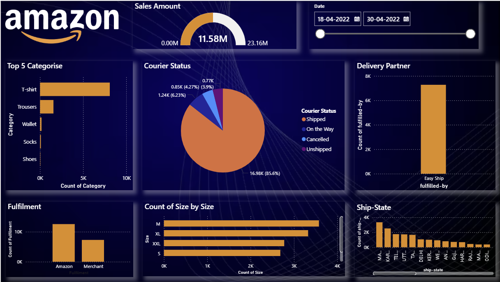

# 🛒 Amazon Sales Dashboard | Power BI

## 📌 Overview

The Amazon Sales Dashboard is an interactive Power BI project designed to analyze sales performance, customer behavior, product categories, order fulfillment, and delivery trends. This dashboard transforms raw sales data into meaningful business insights through dynamic visualizations and KPIs.

---

## 🎯 Project Objectives

* Analyze overall sales performance
* Identify top-selling products and categories
* Monitor order fulfillment status
* Track state-wise sales distribution
* Understand customer purchasing trends
* Support data-driven business decisions

---

## 📊 Dashboard Preview

---

## 🚀 Key Features

✅ Interactive Power BI Dashboard

✅ Sales Performance Analysis

✅ Category-wise Revenue Breakdown

✅ State-wise Order Distribution

✅ Fulfillment & Delivery Tracking

✅ Dynamic Filters and Slicers

✅ KPI Monitoring

✅ Business Insight Generation

---

## 📈 Key Metrics

* Total Sales Revenue
* Number of Orders
* Top Selling Categories
* Courier Status Analysis
* Fulfillment Performance
* State-wise Sales Contribution
* Customer Purchase Trends

---

## 🛠️ Tools & Technologies

| Tool           | Purpose                        |
| -------------- | ------------------------------ |
| Power BI       | Dashboard Development          |
| Power Query    | Data Cleaning & Transformation |
| DAX            | KPI Calculations               |
| Excel / CSV    | Data Source                    |
| Data Analytics | Business Insights              |

---

## 📂 Project Structure

Amazon-Sales-Dashboard/

├── Amazon_Sales_Dashboard.pbix

├── dashboard.png

├── README.md

└── Amazon_Sales.csv

---

## 📋 Business Insights

* T-Shirts contribute significantly to overall sales.
* Maharashtra generates a major share of total orders.
* Amazon Fulfillment handles most deliveries.
* Certain categories consistently outperform others.
* Interactive filtering enables detailed regional analysis.

---

## 🎓 Skills Demonstrated

* Data Cleaning
* Data Transformation
* Data Visualization
* Dashboard Design
* DAX Calculations
* Business Analytics
* Power BI Reporting

---

## 💡 Future Enhancements

* Sales Forecasting using Machine Learning
* Customer Segmentation
* Profitability Analysis
* Real-Time Data Integration
* Advanced KPI Tracking

---

## 👨‍💻 Author

**Aditya Bhosale**

B.Tech – Artificial Intelligence & Machine Learning

Aspiring Data Analyst | Power BI Developer | AI & Analytics Enthusiast

